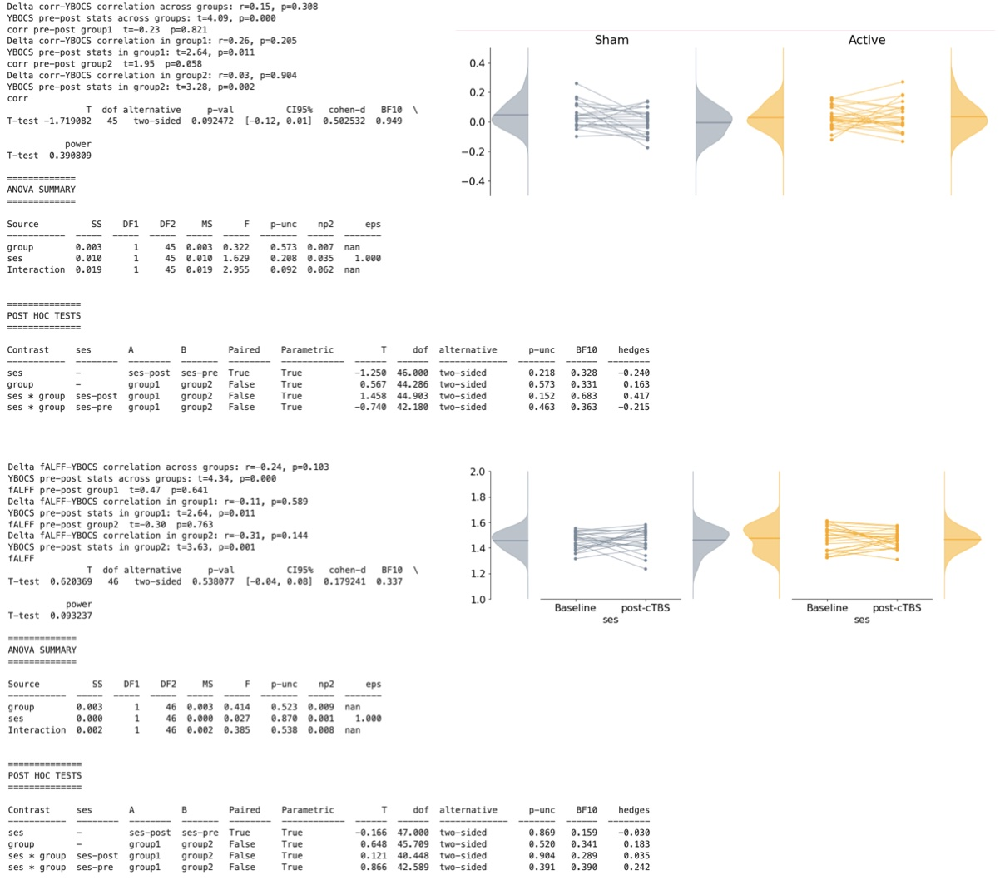
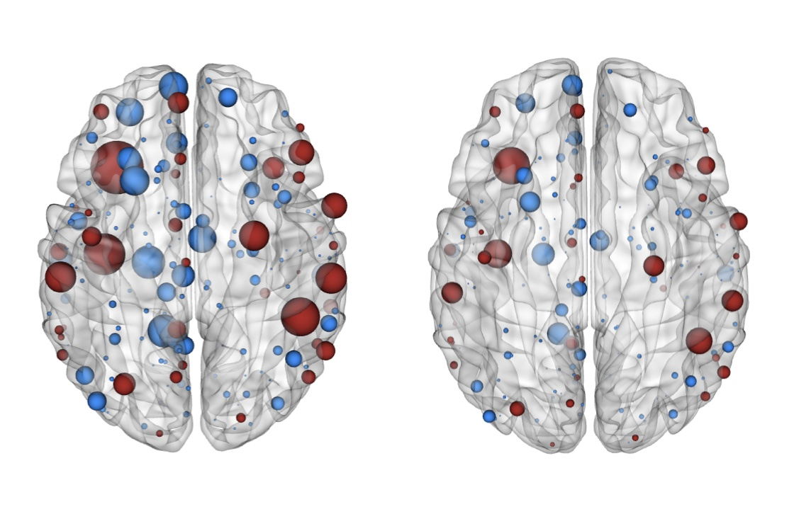

Clinical Trial OCD Neuroimaging
=========================================
Functional Neuroimaging analysis of OCD clinical trial data derived from baseline analysis. Check our baseline paper in Brain: [Naze et al. (2022)](https://academic.oup.com/brain/advance-article-abstract/doi/10.1093/brain/awac425/6830574)

___Note___: *The statistical analysis from the* **Clinical outcomes** *section is in the* **R** *parent directory (R v4.1.3) and is independent of the python package described below.*

<!-- dependencies: pybct, h5py, nibabel, nilearn, pandas, scipy, sklearn, statsmodel.
     insert badges instead -->

Table of contents
-----------------
- [Clinical Trial OCD Neuroimaging](#clinical-trial-ocd-neuroimaging)
  - [Table of contents](#table-of-contents)
  - [Installation](#installation)
  - [Usage](#usage)
  - [Functional connectivity and fractional amplitude low-frequency fluctuations analysis](#functional-connectivity-and-fractional-amplitude-low-frequency-fluctuations-analysis)
  - [Network-based Statistics (NBS)](#network-based-statistics-nbs)
  - [Visualizations](#visualizations)
  - [Licence](#licence)
  - [Authors and history](#authors-and-history)
  - [Acknowledgments](#acknowledgments)

## Installation
> Tested on Ubuntu 20.04
> Linux-5.8.0

It is strongly advised to install the package in a new virtual environment using python 3.9:

    pyenv install 3.9.16 OCDenv
    pyenv activate OCDenv

Then from the root of the OCDbaseline source repository (where the `setup.py` is located), type

    pip install -e .

## Usage
This work is an extension of the OCD baseline analysis ([Naze et al. (2022)](https://academic.oup.com/brain/advance-article-abstract/doi/10.1093/brain/awac425/6830574)), now applied to the clinical trial data before and after Transcranial Magnetic Stimulation (TMS). 

The project is packaged in this repository and have dependencies from the baseline repo/package. 

The code performs:
- functional connectivity analysis: to perform seed-to-voxel analysis of neuroimaging data (fMRI) active vs. sham.
- power analysis: to analyze fractional amplitude low-frequency fluctuations (fALFF) differences between active and sham.
- network-based statistics: 
- visualizations: to project stimulation sites besides cortical surface. 

## Functional connectivity and fractional amplitude low-frequency fluctuations analysis
> The functional analysis assumes that [fMRIPrep](https://github.com/nipreps/fmriprep) has already been run. Before running the following scripts, ensure that the path to the project directory `proj_dir` is correctly set in those scripts and that the output folder `derivatives` has been generated from fMRIPrep with its adequate content.

To perform several preprocessing steps (denoising, filtering, global signal regression, scrubbing, etc.); from the HPC cluster, run the following PBS script

    preprocessing/prep_seed-to-voxel.pbs

This calls `preprocessing/post_fmriprep_denoising.py` with a set of default preprocessing parameters. See this file for more details about the preprocessing pipeline and the [fmripop](https://github.com/brain-modelling-group/fmripop) package.

Then, it calls `functional/seed_to_voxel_analysis.py`  to compute fronto-striatal brain correlations using seeds from [Harrison et al. (2009)](https://jamanetwork.com/journals/jamapsychiatry/fullarticle/210415) and used in [Naze et al. (2022)](https://academic.oup.com/brain/advance-article-abstract/doi/10.1093/brain/awac425/6830574). 

The analysis focuses:
1) on the changes of functional connectivity between the nucleus accumbens (NAcc) and the stimulation site in the orbito-frontal cortex (OFC), before and after treatment. 
2) on the change in BOLD signal power within the stimulation site , before and after treatment. 

To extract those using a 5mm radius and a full-width half maxima spatial smoothing of 8mm, plot the kernel density extimates of the outputs and run the statistical analysis (two-way mixed ANOVA), run:

    python functional/seed_to_voxel_analysis.py --compute_voi_corr --compute_ALFF --stim_radius 5 --brain_smoothing_fwhm 8 --save_outputs --plot_pointplot --print_stats

The output should look like this _(extact values may differ according to parameters)_:

## Network-based Statistics (NBS)
To run the network-based statistics analysis for the main effect between sessions (i.e. paired t-test on FC pre vs. post TMS, collapsing groups), using a threshold of 3.5 and 5000 permutations:

    python functional/seed_to_voxel_analysis.py --compute_nbs --nbs_session --nbs_paired --nbs_thresh 3.5 --n_perm 5000

To run the NBS analysis on the interaction (i.e. unpaired t-test on group difference, using "pre minus post TMS" within group contrast):

    python functional/seed_to_voxel_analysis.py --compute_nbs --nbs_thresh 3.5 --n_perm 5000

## Visualizations
To visualize the output of the NBS analysis as spheres which size represent the node degree, run
    python graphics/ct_visuals.py --plot_figs --plot_surface --show_roi_degree 

Licence
-------

This work is licensed under a Creative Commons Attribution 4.0 International License.

Authors and history
-------------------

This code was contributed by Sebastien Naze for QIMR Berghofer in 2021-2022.

Acknowledgments
---------------

Australian NHMRC Grant number # GN2001283 and clinical trial # ACTRN12616001687482
